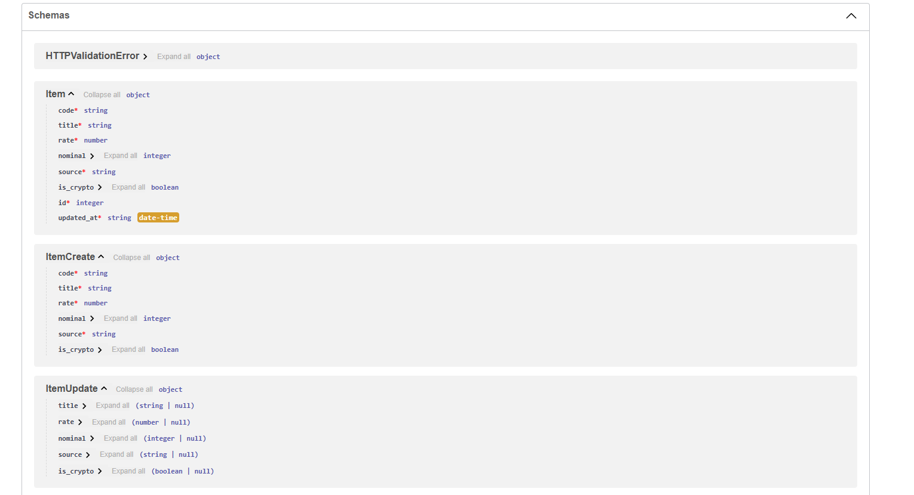
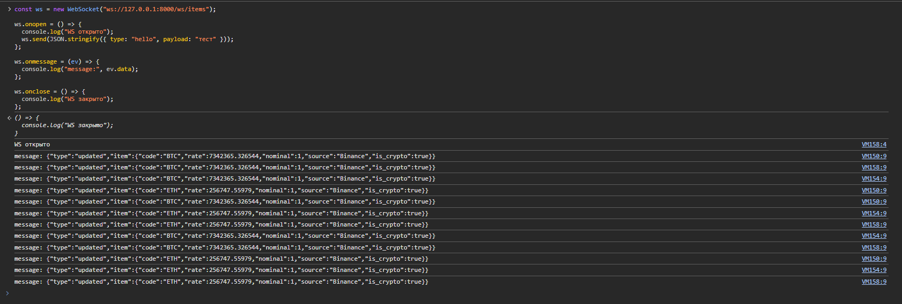
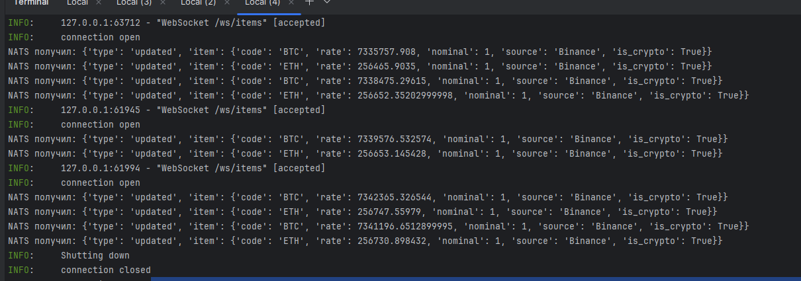
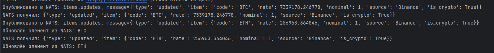

# project

# Запуск проекта

Все запускается из корня репозитория!!!! (**final_todo** или как называется папка где лежит этот проект):

```bash
uvicorn app.main:app
```

Запуск докер контейнера для NATS:

```bash
docker compose up -d
```






